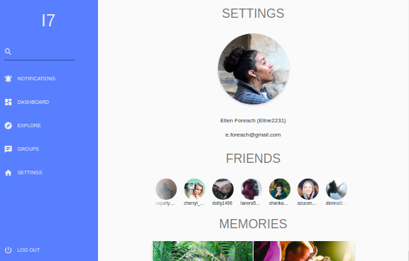
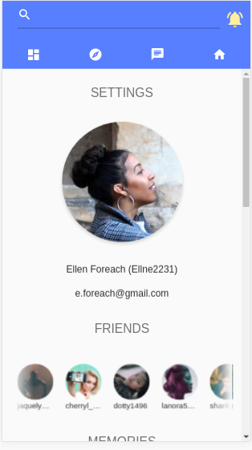

# I7 Dokumentacja

# Spis Treści

- Opis
- Budowa projektu z `Node`
- Budowa projektu za pomocą `Dockera`
- Kopiowanie folderu `dist` z kontenera do hosta
- Deploy to aws s3

# Opis

Responsywna makieta aplikacji webowej, napisana w TypeScript z wykorzystaniem frameworku Angular.

Fig 1. Przykładowy widok aplikacji na desktopie.

Fig 2. Przykładowy widok aplikacji na urządzeniu mobilnym.

# Budowa projektu z `Node`

Wymagane zależności:
- node v8+ (wraz z npm v5+)

Do instalacji node polecam nvm (https://github.com/creationix/nvm)

Instalacja node używając nvm:

    $ nvm install stable
    $ nvm use stable

Po aktywowanie stabilnej wersji node, zainstaluj yarn

    $ npm install -g yarn

Teraz możemy pobrać wszystkie zależności aplikacji za pomocą następującego polecenia

    $ yarn

Aby uruchomić serwer aplikacji wykonaj polecenie:

    $ yarn start

Aplikacja powinna być teraz dostępna pod adresem: http://localhost:4200

# Budowa projektu za pomocą `Dockera`

    docker build -t registry.gitlab.com/meme7/i7/i7_frontend .

# Kopiowanie folderu `dist` z kontenera do hosta:

    docker run \
        --rm \
        -v $HOME/Projects/i7_root/i7_frontend/dist/:/dist/ \
        registry.gitlab.com/meme7/i7/i7_frontend \
        cp -r /src/dist/ /

# Deploy to aws s3

Najpierw musisz wyeksportować następujące zmiennie środowiskowe:

    export AWS_ACCESS_KEY_ID=<key_here>
    export AWS_SECRET_ACCESS_KEY=<key_here>

Następnie wykonaj polecenie:

    docker run \
        --rm \
        -e AWS_ACCESS_KEY_ID=${AWS_ACCESS_KEY_ID} \
        -e AWS_SECRET_ACCESS_KEY=${AWS_SECRET_ACCESS_KEY} \
        registry.gitlab.com/meme7/i7/i7_frontend deploy
